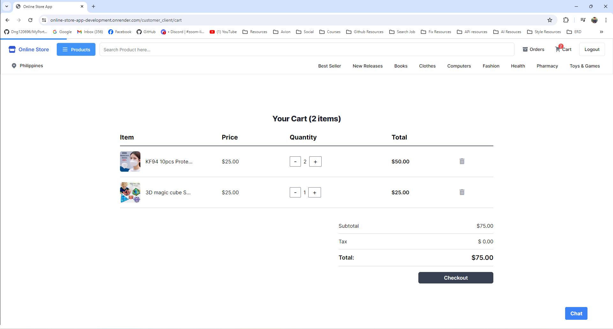
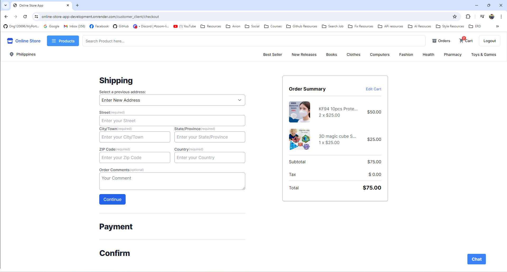

# Online Store App

## Overview

Welcome to our Online Store App, a robust web application built with Ruby on Rails. This document outlines the key features and customer stories that define our platform's functionality. Our application aims to provide a seamless shopping experience through comprehensive features including user authentication, product management, cart and checkout systems, payment integration with PayMongo API, order management, and a chat capabilities via SendBird API.

## Table of Contents
1. [Features](#features)
2. [Images](#images)
2. [Testing App](#testing-app)
3. [Getting Started](#getting-started)
4. [System Dependencies](#system-dependencies)
5. [Contact Information](#contact-information)

## Features

### Customers

#### Account Management
- Create an account with an address.
- Log in with credentials.
- Confirm email Address

#### Product Interaction
- Add products to the cart.
- View the cart page.
- Browse all products.
- View product details.
- Search for products.

#### Checkout Process (using Paymongo API)
- Checkout products in the cart.
- Add a new shipping address during checkout.
- Select an existing shipping address during checkout.
- Input payment details using PayMongo API.
- Choose between GCash or card payment options.
- Confirm the order and be redirected to PayMongo.
- Receive order email notification.

#### Order Management
- View order transaction list with filters (completed, shipped, cancelled, etc).
- Can Cancel a pending order and receive email notification.
- Can Request a refund for received orders and receive email notification.
- Can Rate products for completed orders.
- View comments on orders if available.

#### Chat (using SendBird API)
- Can Ask questions to an AIChatbot chat
- Can Message the Admin

#### Images
- We use aws Amazon S3 storage for the images uploaded in our application

### Admin

#### Dashboard
- Chart for Order Total Amount per day for 1 month
- Can See the Total Order Amount, Cancelled Amount, and Refund Amount
- Table List of statuses for the order

#### Product Management
- Create, read, update, and delete products.

#### Order Management
- Update the status of orders.

#### Customer Management
- Create, read, update, and delete customers.

#### Message Management
- Admin Can Receive Messages from Customer.
- Can Send Messages to Customer.

## Images
### **ERD**


### **Online Store App Views**

#### **Home page**


#### **Product page**


#### **Cart Modal**


#### **Cart Page**



#### **Product Details**


#### **Checkout page**



#### **Payment page**


#### **Confirm Orders page**


#### **Thank you page**


#### **Orders Pending page**


#### **Refund Received Orders**


#### **Rating Completed Orders**


Check out the live demo of the app in the link below:

[Online Store Application](https://online-store-app-development.onrender.com)

## Testing App
  ### Card Payment Test
    - Card Number: 4343434343434345
  ### User Account
    - Email: user@user.com  
    - Password: password123

## Getting Started

### Prerequisites

The setup steps expect the following tools to be installed on the system:
- Ruby
- Rails
- PostgreSQL

### Instructions

These instructions will get you a copy of the project up and running on your local machine for development and testing purposes.

- Clone the repository and navigate to the main app directory

```bash
git clone https://github.com/Dng120696/Online_Store_App.git
cd Online_Store_App
```

- Install libraries and dependencies

```bash
bundle install
```

- Initialize the database

```bash
rails db:create
rails db:migrate
rails db:seed
```


- Run the server

```bash
./bin/dev
```

## **System dependencies**

### **Gems**

- Devise 4.8.1
- tailwindcss-rails 2.6
- chartkick
- groupdate
- faraday
- aws-sdk-s3

## Created by

**Development Team:**

- **Christian Patrick Nebab**
  - Email: [christianpatrickcnebab@gmail.com](mailto:christianpatrickcnebab@gmail.com)

- **Jeffrey Binas**
- **Jamie Sison**
- **Chad Ayop**
