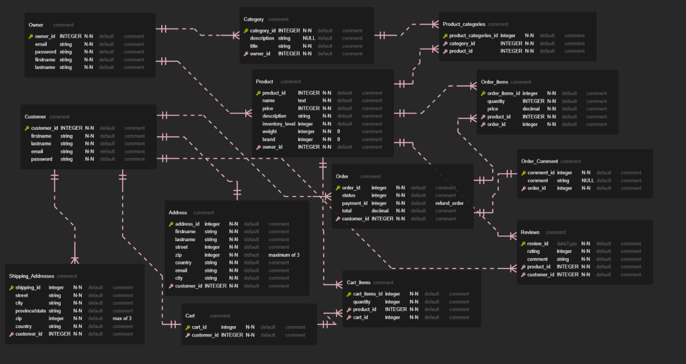

# Online Store Application with Rails Application README

## Overview

Welcome to our Online Store Application, a robust web application built with Ruby on Rails. This document outlines the key features and customer stories that define our platform's functionality. Our application aims to provide a seamless shopping experience through comprehensive features including user authentication, product management, cart and checkout systems, payment integration with PayMongo, order management, and a chat capabilities via SendBird API.

## Table of Contents
1. [User Stories](#user-stories)
    - [Customers](#customers)
    - [Admin](#admin)
2. [Images](#images)
3. [Getting Started](#getting-started)
4. [System Dependencies](#system-dependencies)
5. [Contact Information](#contact-information)

## User Stories

### Customers
- **User Story #1:** As a Customer, I want to create an account with an address to buy products.
- **User Story #2:** As a Customer, I want to log in with my credentials so that I can access my account on the app.
- **User Story #3:** As a Customer, I want to add a product to my cart.
- **User Story #4:** As a Customer, I want to view my cart page.
- **User Story #5:** As a Customer, I want to see all the products.
- **User Story #6:** As a Customer, I want to see categories per product.
- **User Story #7:** As a Customer, I want to search for a product.
- **User Story #8:** As a Customer, I want to checkout my products in the cart.
- **User Story #9:** As a Customer, I want to see a checkout page.
- **User Story #10:** As a Customer, I want to add a new shipping address during checkout.
- **User Story #11:** As a Customer, I want to select an existing shipping address during checkout.
- **User Story #12:** As a Customer, I want to input payment details using PayMongo API.
- **User Story #13:** As a Customer, I want to select either GCash or card payment options.
- **User Story #14:** As a Customer, I want to confirm my order and be redirected to the PayMongo site.
- **User Story #15:** As a Customer, I want to receive emails for order confirmations.
- **User Story #16:** As a Customer, I want to see a thank you page after placing an order.
- **User Story #17:** As a Customer, I want to view my order transaction list with filters for completed, shipped, and cancelled orders.
- **User Story #18:** As a Customer, I want to cancel an order if it is still pending and receive an email confirmation for the cancellation.
- **User Story #19:** As a Customer, I want to request a refund if the order status is received and receive an email confirmation for the refund.
- **User Story #20:** As a Customer, I want to rate products if the order status is completed.
- **User Story #21:** As a Customer, I want to view comments for my orders if they exist.

### Admin  

- **User Story #1:** As an Admin, I want to optionally view charts for orders and revenue on the dashboard page.
- **User Story #1:** As an Admin, I want to manage products (CRUD) on the products page.
- **User Story #2:** As an Admin, I want to update the status of orders on the orders page.
- **User Story #3:** As an Admin, I want to manage customers (CRUD) on the customers page.
- **User Story #4:** As an Admin, I want to manage messages of users (ongoing).

## Images
### **ERD**


### **Online Store App Views**

#### **Home page**


#### **Product page**


#### **Cart Modal**


#### **Cart Page**


#### **Product Details**


#### **Checkout page**


#### **Payment page**


#### **Orders page**


Check out the live demo of the app in the link below:

[Online Store Application]()
## Getting Started

### Prerequisites

The setup steps expect the following tools to be installed on the system:
- Ruby
- Rails
- PostgreSQL

### Instructions

These instructions will get you a copy of the project up and running on your local machine for development and testing purposes.

- Clone the repository and navigate to the main app directory

```bash
git clone https://github.com/Dng120696/Online_Store_App.git
cd Online_Store_App
```

- Install libraries and dependencies

```bash
bundle install
```

- Initialize the database

```bash
rails db:create
rails db:migrate
rails db:seed
```


- Run the server

```bash
./bin/dev
```

## **System dependencies**

### **Gems**

- Devise 4.8.1
- tailwindcss-rails 2.6
- chartkick
- groupdate
- faraday

## Created by

**Development Team:**

- **Christian Patrick Nebab**
  - Email: [christianpatrickcnebab@gmail.com](mailto:christianpatrickcnebab@gmail.com)

- **Jeffrey Binas**
- **Jamie Sison**
- **Chad Ayop**
